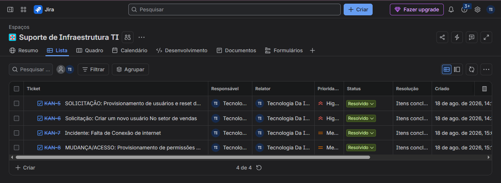

# 🛠️ GERENCIAMENTO DE SERVIÇOS DE TI (ITSM) NO JIRA SERVICE MANAGEMENT

## 👤 Sobre o Autor
- **Perfil:** Tecnólogo em Análise e Desenvolvimento de Sistemas
- **Certificações:** ITIL® 4 Foundation (ITSM) | Suporte Técnico (Google/Coursera)
- **Especialidade:** Governança de TI, Redes, Gestão de Incidentes e Suporte de Nível 2

## 🎯 1. Escopo do Projeto e Alinhamento ITIL 4
Este projeto documenta a estruturação e a operação de uma Central de Serviços (Service Desk) baseada em nuvem utilizando o **Jira Service Management**. O objetivo foi aplicar na prática os conceitos do framework ITIL 4 para triar, mitigar, auditar e gerenciar o ciclo de vida completo de incidentes e requisições gerados no ambiente de infraestrutura técnica de servidores corporativos.

---

## 🚨 2. Gerenciamento de Incidentes (Incident Management)

### Ticket KAN-7: Falha de Conectividade de Rede Local (Isolamento de Endpoint)
- **Cenário Identificado:** Usuário operando estação cliente Windows 10 relatou perda total de conectividade de rede ("ícone de mundinho com bloqueio") após alteração física de layout de mesa no setor de Faturamento.
- **Análise e Escopo:** Verificado via isolamento de escopo que o problema era local, visto que os demais colaboradores do setor mantinham conexão estável à internet e aos servidores.
- **Troubleshooting e Resolução:** Comando `ipconfig` executado via Prompt de Comando (CMD) retornou o status de **"mídia desconectada"** (*Network cable unplugged*). Realizada a inspeção física do hardware e constatado que o cabo Ethernet azul estava desencaixado da interface. Efetuada a reconexão física firme do cabo até o travamento. O acesso ao sistema ERP e à pasta de arquivos em rede foi normalizado imediatamente.

---

## 🔑 3. Cumprimento de Requisições (Service Request Fulfillment)

### Ticket KAN-5: Provisionamento de Contas e Reset de Segurança no AD DS
- **Cenário Identificado:** Necessidade de onboarding e criação de credenciais para novos funcionários do departamento de tecnologia.
- **Ações Realizadas:** Estruturada a hierarquia organizacional criando a Unidade Organizacional (OU) corporativa chamada **TI** no Active Directory Users and Computers (ADUC) para segregação de privilégios. Criadas as contas de logon `maria.silva` e `carlos.mendonca` (aplicando as boas práticas internacionais de não utilizar caracteres especiais ou acentos).
- **Tratamento de Contorno:** Executado o reset preventivo e temporário da credencial do administrador para `Suporte2026`, visando sanar violações de política padrão e contornar incompatibilidades de layout de teclado regional.

### Ticket KAN-6: Abertura de Conta de Usuário no Setor Comercial/Vendas
- **Cenário Identificado:** Solicitação padrão de criação de acessos para novos colaboradores do time de vendas.
- **Ações Realizadas:** Provisionamento de novo usuário no Active Directory alocado na árvore hierárquica respectiva da organização, aplicando regras rígidas de complexidade de senha (mínimo de 7 dígitos mesclando caracteres maiúsculos, minúsculos e números).

---

## 🔄 4. Gerenciamento de Mudanças (Change Enablement)

### Ticket KAN-8: Homologação de Estação e Hardening de Diretivas de Segurança
- **Cenário Identificado:** Homologação do ingresso da máquina Windows 10 Cliente no domínio corporativo e aplicação das regras de proteção de dados.
- **Ações Realizadas:** Realizado o ingresso do terminal Windows 10 Pro no domínio raiz `suporte.local`. Inclusão dos usuários no Grupo Global **GG_TI** para concessão imediata de privilégios NTFS de nível *Modify* (Modificação) na pasta física raiz compartilhada via rede através do protocolo SMB (`C:\Arquivos_Empresa`).
- **Endurecimento de Segurança (Hardening):** Criação e vinculação de GPOs (Group Policy Objects) restritivas para bloquear o acesso de usuários comuns ao Prompt de Comando (CMD) e ao Painel de Controle, garantindo a Confidencialidade e a Integridade dos dados da empresa. Forçada a leitura imediata das novas políticas no ambiente corporativo utilizando o comando `gpupdate /force`.

---

## 📊 5. Métricas de Auditoria e Encerramento de Tickets
Todos os quatro chamados técnicos foram triados através do Quadro Kanban, avançando pelas etapas de controle de fluxo de atendimento. 

Para manter o padrão de auditoria corporativa e a integridade de relatórios de SLA, foi realizada a correção manual dos campos internos, alterando o status definitivo dos quatro itens de "Não resolvido" para **"Resolvido / Itens Concluídos"** (verde), zerando a fila com sucesso.

